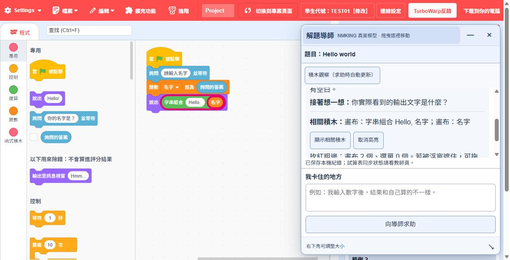
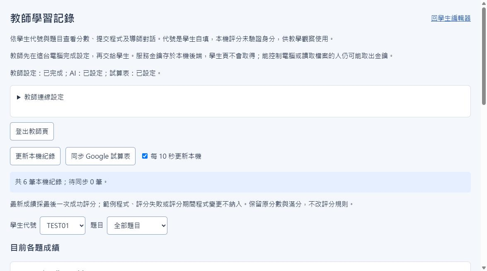
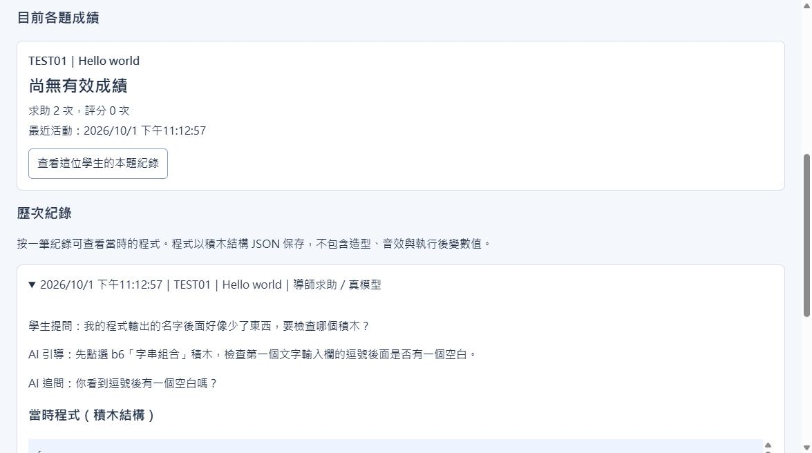
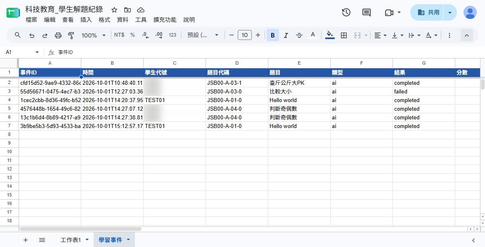

# osep-judge

osep-judge 是一個以 Scratch 積木程式解題為主的教學平台，介面對準台師大官方程
式解題平台（demo.csie.ntnu.edu.tw/ps）修改，供國小學生練習程式解題與縣市競
賽準備使用。

## 我該用哪一種？

| 如果你的需要是…… | 請使用…… |
| --- | --- |
| 只要讓學生練題、評分 | **線上網站（GitHub Pages 靜態版）**：<https://bai-collab.github.io/osep-judge/>，不用安裝，但沒有 AI 導師與教師紀錄。 |
| 要 AI 解題導師、學生紀錄、Google 試算表 | **本機安裝版**：到 [Releases](https://github.com/bai-collab/osep-judge/releases/latest) 下載 `osep-judge-local-tutor.zip`（免建置），解壓後雙擊 `start-tutor.cmd`；完整步驟見 [教師快速設定](TEACHER-SETUP.md)。 |
| 同教室學生電腦只開瀏覽器，連教師機用導師 | **區網模式**：教師機設定完成後雙擊 `start-tutor-lan.cmd`，學生開視窗顯示的 `http://教師機區網IP:8612/editor.html`；金鑰只留教師機。步驟、防火牆與剩餘風險見 [教師快速設定第 6 節](TEACHER-SETUP.md#6-區網模式學生電腦只開瀏覽器)。 |

## 本機 AI 解題導師與教師記錄

新增同頁浮動解題導師、相關積木高亮、學生提問／評分紀錄，以及教師查看與 Google 試算表同步。本機服務需啟動後才可使用；GitHub Pages 只有靜態編輯器，不能執行本機 API。

- **第一次使用與設定**：[教師快速設定](TEACHER-SETUP.md)，包含下載建置、API 金鑰、Google Apps Script 與交給學生的步驟。
- **導師操作與限制**：[本機解題導師](LOCAL-TUTOR.md)。
- **記錄與同步**：[學習記錄](LEARNING-RECORDS.md)。
- **Google 腳本**：[Code.gs](scripts/tutor/sheets/Code.gs)。
- **AI 金鑰來源**：[生生有Token－AI額度管理平臺介紹](https://www.sdc.org.tw/115-118/product/%E7%94%9F%E7%94%9F%E6%9C%89token-ai%E9%A1%8D%E5%BA%A6%E7%AE%A1%E7%90%86%E5%B9%B3%E8%87%BA/)，申請與設定方式見 [教師設定中的「AI 金鑰從哪裡來」](TEACHER-SETUP.md#ai-金鑰從哪裡來)。

帳密與學生紀錄只放本機 `local-data/`，不隨 Git 提交；不要把這個資料夾複製給學生或上傳 GitHub。

### 畫面一覽

以下截圖使用測試代號 `TEST01`；試算表中其他學生的代號已模糊處理。

**1. 學生與 AI 導師討論時，相關積木會被標出來**

學生先在頂端紅色選單列的「學生代號」填寫並確認代號（未填時會自動展開醒目提醒），導師模式則在旁邊的「連線設定」切換。接著在浮動的「解題導師」視窗描述卡住的地方，導師回覆「這一輪先做」與「接著想一想」。回覆提到的積木會在畫布或左側選單用玫紅粗邊標出；若在左側選單，會自動捲動到該積木，學生不用自己找。按「取消高亮」可恢復原樣；導師只標示，不會替學生拖曳或執行積木。



**2. 教師網頁查看學生作答歷程**

教師登入 `http://127.0.0.1:8612/teacher.html` 後，可依學生代號與題目篩選，看到每題的求助次數、評分次數與最新成績。



展開「歷次紀錄」中的任一筆，可看到學生當時的提問、AI 引導與追問，以及當下的程式（積木結構）。



**3. Google 試算表保存作答歷程**

設定 Google Apps Script 後，每筆求助與評分會同步到教師自己的私人試算表「學習事件」分頁，包含時間、學生代號、題目、類型、結果與分數；多台學生電腦的紀錄可集中在同一張表。設定方式見 [教師快速設定](TEACHER-SETUP.md#3-建立-google-試算表與-gas)。



## 課程內容

- **114學年度縣市競賽題目**：由參與共享的17個縣市提供（16個縣市已上架，連
  江縣114學年度未辦理縣市賽故暫無題目），僅限參與縣市師生教育目的使用，詳
  見下方「使用範圍」與 `NOTICE.md`。

## 使用範圍

本平台僅供**已加入題庫共享的縣市**師生免費使用。請勿將平台網址或課程代碼分
享給未參與共享的縣市人員，以維護參與縣市及共享題庫的立意——這是使用禮儀上
的請求，並非平台技術或法律上真正擋得住的限制，仍請共同維護。

課程代碼將於**2026年9月開學後**擇日舉辦之線上研習中公布，並說明平台使用方
式，歡迎參與縣市夥伴自由參加。

## 授權

- **平台程式碼**：本專案為 [TurboWarp](https://turbowarp.org/) 修改版
  scratch-gui 的延伸，程式碼採用 GNU General Public License v3.0
  （GPL-3.0），詳見 `LICENSE`。GPL-3.0是繼承自上游的強制性授權，不能改成
  「不得商用」「僅限特定對象」等更嚴格的條款。
- **課程內容**：與程式碼授權分開處理，114學年度縣市競賽題目適用限定對象使
  用條款，詳見 `NOTICE.md`。

---

以下為上游 TurboWarp／scratch-gui 原始 README 內容，因授權要求需保留：

---

scratch-gui modified for use in [TurboWarp](https://turbowarp.org/)

## Setup

See https://docs.turbowarp.org/development/getting-started to setup the complete TurboWarp environment.

If you just want to play with the GUI then it's the same process as upstream scratch-gui.

## License

TurboWarp's modifications to Scratch are licensed under the GNU General Public License v3.0. See LICENSE or https://www.gnu.org/licenses/ for details.

The following is the original license for scratch-gui, which we are required to retain. This is NOT the license of this project.

```
Copyright (c) 2016, Massachusetts Institute of Technology
All rights reserved.

Redistribution and use in source and binary forms, with or without modification, are permitted provided that the following conditions are met:

1. Redistributions of source code must retain the above copyright notice, this list of conditions and the following disclaimer.

2. Redistributions in binary form must reproduce the above copyright notice, this list of conditions and the following disclaimer in the documentation and/or other materials provided with the distribution.

3. Neither the name of the copyright holder nor the names of its contributors may be used to endorse or promote products derived from this software without specific prior written permission.

THIS SOFTWARE IS PROVIDED BY THE COPYRIGHT HOLDERS AND CONTRIBUTORS "AS IS" AND ANY EXPRESS OR IMPLIED WARRANTIES, INCLUDING, BUT NOT LIMITED TO, THE IMPLIED WARRANTIES OF MERCHANTABILITY AND FITNESS FOR A PARTICULAR PURPOSE ARE DISCLAIMED. IN NO EVENT SHALL THE COPYRIGHT HOLDER OR CONTRIBUTORS BE LIABLE FOR ANY DIRECT, INDIRECT, INCIDENTAL, SPECIAL, EXEMPLARY, OR CONSEQUENTIAL DAMAGES (INCLUDING, BUT NOT LIMITED TO, PROCUREMENT OF SUBSTITUTE GOODS OR SERVICES; LOSS OF USE, DATA, OR PROFITS; OR BUSINESS INTERRUPTION) HOWEVER CAUSED AND ON ANY THEORY OF LIABILITY, WHETHER IN CONTRACT, STRICT LIABILITY, OR TORT (INCLUDING NEGLIGENCE OR OTHERWISE) ARISING IN ANY WAY OUT OF THE USE OF THIS SOFTWARE, EVEN IF ADVISED OF THE POSSIBILITY OF SUCH DAMAGE.
```

src/lib/default-project/dango.svg is based on [Twemoji](https://twemoji.twitter.com/) and is licensed under CC BY 4.0 https://creativecommons.org/licenses/by/4.0/

<!--

# scratch-gui
#### Scratch GUI is a set of React components that comprise the interface for creating and running Scratch 3.0 projects

## Installation
This requires you to have Git and Node.js installed.

In your own node environment/application:
```bash
npm install https://github.com/LLK/scratch-gui.git
```
If you want to edit/play yourself:
```bash
git clone https://github.com/LLK/scratch-gui.git
cd scratch-gui
npm install
```

**You may want to add `--depth=1` to the `git clone` command because there are some [large files in the git repository history](https://github.com/LLK/scratch-gui/issues/5140).**

## Getting started
Running the project requires Node.js to be installed.

## Running
Open a Command Prompt or Terminal in the repository and run:
```bash
npm start
```
Then go to [http://localhost:8601/](http://localhost:8601/) - the playground outputs the default GUI component

## Developing alongside other Scratch repositories

### Getting another repo to point to this code


If you wish to develop `scratch-gui` alongside other scratch repositories that depend on it, you may wish
to have the other repositories use your local `scratch-gui` build instead of fetching the current production
version of the scratch-gui that is found by default using `npm install`.

Here's how to link your local `scratch-gui` code to another project's `node_modules/scratch-gui`.

#### Configuration

1. In your local `scratch-gui` repository's top level:
    1. Make sure you have run `npm install`
    2. Build the `dist` directory by running `BUILD_MODE=dist npm run build`
    3. Establish a link to this repository by running `npm link`

2. From the top level of each repository (such as `scratch-www`) that depends on `scratch-gui`:
    1. Make sure you have run `npm install`
    2. Run `npm link scratch-gui`
    3. Build or run the repository

#### Using `npm run watch`

Instead of `BUILD_MODE=dist npm run build`, you can use `BUILD_MODE=dist npm run watch` instead. This will watch for changes to your `scratch-gui` code, and automatically rebuild when there are changes. Sometimes this has been unreliable; if you are having problems, try going back to `BUILD_MODE=dist npm run build` until you resolve them.

#### Oh no! It didn't work!

If you can't get linking to work right, try:
* Follow the recipe above step by step and don't change the order. It is especially important to run `npm install` _before_ `npm link` as installing after the linking will reset the linking.
* Make sure the repositories are siblings on your machine's file tree, like `.../.../MY_SCRATCH_DEV_DIRECTORY/scratch-gui/` and `.../.../MY_SCRATCH_DEV_DIRECTORY/scratch-www/`.
* Consistent node.js version: If you have multiple Terminal tabs or windows open for the different Scratch repositories, make sure to use the same node version in all of them.
* If nothing else works, unlink the repositories by running `npm unlink` in both, and start over.

## Testing
### Documentation

You may want to review the documentation for [Jest](https://facebook.github.io/jest/docs/en/api.html) and [Enzyme](http://airbnb.io/enzyme/docs/api/) as you write your tests.

See [jest cli docs](https://facebook.github.io/jest/docs/en/cli.html#content) for more options.

### Running tests

*NOTE: If you're a Windows user, please run these scripts in Windows `cmd.exe`  instead of Git Bash/MINGW64.*

Before running any tests, make sure you have run `npm install` from this (scratch-gui) repository's top level.

#### Main testing command

To run linter, unit tests, build, and integration tests, all at once:
```bash
npm test
```

#### Running unit tests

To run unit tests in isolation:
```bash
npm run test:unit
```

To run unit tests in watch mode (watches for code changes and continuously runs tests):
```bash
npm run test:unit -- --watch
```

You can run a single file of integration tests (in this example, the `button` tests):

```bash
$(npm bin)/jest --runInBand test/unit/components/button.test.jsx
```

#### Running integration tests

Integration tests use a headless browser to manipulate the actual HTML and javascript that the repo
produces. You will not see this activity (though you can hear it when sounds are played!).

Note that integration tests require you to first create a build that can be loaded in a browser:

```bash
npm run build
```

Then, you can run all integration tests:

```bash
npm run test:integration
```

Or, you can run a single file of integration tests (in this example, the `backpack` tests):

```bash
$(npm bin)/jest --runInBand test/integration/backpack.test.js
```

If you want to watch the browser as it runs the test, rather than running headless, use:

```bash
USE_HEADLESS=no $(npm bin)/jest --runInBand test/integration/backpack.test.js
```

_Note: If you are seeing failed tests related to `chromedriver` being incompatible with your version of Chrome, you may need to update `chromedriver` with:_

```bash
npm install chromedriver@{version}
```

## Troubleshooting

### Ignoring optional dependencies

When running `npm install`, you can get warnings about optional dependencies:

```
npm WARN optional Skipping failed optional dependency /chokidar/fsevents:
npm WARN notsup Not compatible with your operating system or architecture: fsevents@1.2.7
```

You can suppress them by adding the `no-optional` switch:

```
npm install --no-optional
```

Further reading: [Stack Overflow](https://stackoverflow.com/questions/36725181/not-compatible-with-your-operating-system-or-architecture-fsevents1-0-11)

### Resolving dependencies

When installing for the first time, you can get warnings that need to be resolved:

```
npm WARN eslint-config-scratch@5.0.0 requires a peer of babel-eslint@^8.0.1 but none was installed.
npm WARN eslint-config-scratch@5.0.0 requires a peer of eslint@^4.0 but none was installed.
npm WARN scratch-paint@0.2.0-prerelease.20190318170811 requires a peer of react-intl-redux@^0.7 but none was installed.
npm WARN scratch-paint@0.2.0-prerelease.20190318170811 requires a peer of react-responsive@^4 but none was installed.
```

You can check which versions are available:

```
npm view react-intl-redux@0.* version
```

You will need to install the required version:

```
npm install  --no-optional --save-dev react-intl-redux@^0.7
```

The dependency itself might have more missing dependencies, which will show up like this:

```
user@machine:~/sources/scratch/scratch-gui (491-translatable-library-objects)$ npm install  --no-optional --save-dev react-intl-redux@^0.7
scratch-gui@0.1.0 /media/cuideigin/Linux/sources/scratch/scratch-gui
├── react-intl-redux@0.7.0
└── UNMET PEER DEPENDENCY react-responsive@5.0.0
```

You will need to install those as well:

```
npm install  --no-optional --save-dev react-responsive@^5.0.0
```

Further reading: [Stack Overflow](https://stackoverflow.com/questions/46602286/npm-requires-a-peer-of-but-all-peers-are-in-package-json-and-node-modules)

## Troubleshooting

If you run into npm install errors, try these steps:
1. run `npm cache clean --force`
2. Delete the node_modules directory
3. Delete package-lock.json
4. run `npm install` again

## Publishing to GitHub Pages
You can publish the GUI to github.io so that others on the Internet can view it.
[Read the wiki for a step-by-step guide.](https://github.com/LLK/scratch-gui/wiki/Publishing-to-GitHub-Pages)

## Understanding the project state machine

Since so much code throughout scratch-gui depends on the state of the project, which goes through many different phases of loading, displaying and saving, we created a "finite state machine" to make it clear which state it is in at any moment. This is contained in the file src/reducers/project-state.js .

It can be hard to understand the code in src/reducers/project-state.js . There are several types of data and functions used, which relate to each other:

### Loading states

These include state constant strings like:

* `NOT_LOADED` (the default state),
* `ERROR`,
* `FETCHING_WITH_ID`,
* `LOADING_VM_WITH_ID`,
* `REMIXING`,
* `SHOWING_WITH_ID`,
* `SHOWING_WITHOUT_ID`,
* etc.

### Transitions

These are names for the action which causes a state change. Some examples are:

* `START_FETCHING_NEW`,
* `DONE_FETCHING_WITH_ID`,
* `DONE_LOADING_VM_WITH_ID`,
* `SET_PROJECT_ID`,
* `START_AUTO_UPDATING`,

### How transitions relate to loading states

Like this diagram of the project state machine shows, various transition actions can move us from one loading state to another:


_Note: for clarity, the diagram above excludes states and transitions relating to error handling._

#### Example

Here's an example of how states transition.

Suppose a user clicks on a project, and the page starts to load with URL https://scratch.mit.edu/projects/123456 .

Here's what will happen in the project state machine:


1. When the app first mounts, the project state is `NOT_LOADED`.
2. The `SET_PROJECT_ID` redux action is dispatched (from src/lib/project-fetcher-hoc.jsx), with `projectId` set to `123456`. This transitions the state from `NOT_LOADED` to `FETCHING_WITH_ID`.
3. The `FETCHING_WITH_ID` state. In src/lib/project-fetcher-hoc.jsx, the `projectId` value `123456` is used to request the data for that project from the server.
4. When the server responds with the data, src/lib/project-fetcher-hoc.jsx dispatches the `DONE_FETCHING_WITH_ID` action, with `projectData` set. This transitions the state from `FETCHING_WITH_ID` to `LOADING_VM_WITH_ID`.
5. The `LOADING_VM_WITH_ID` state. In src/lib/vm-manager-hoc.jsx, we load the `projectData` into Scratch's virtual machine ("the vm").
6. When loading is done, src/lib/vm-manager-hoc.jsx dispatches the `DONE_LOADING_VM_WITH_ID` action. This transitions the state from `LOADING_VM_WITH_ID` to `SHOWING_WITH_ID`
7. The `SHOWING_WITH_ID` state. Now the project appears normally and is playable and editable.

## Donate
We provide [Scratch](https://scratch.mit.edu) free of charge, and want to keep it that way! Please consider making a [donation](https://www.scratchfoundation.org/donate) to support our continued engineering, design, community, and resource development efforts. Donations of any size are appreciated. Thank you!
-->
